# 基於FPGA實現PSK調變之期末報告
班級：電機三乙<br>
報告撰寫者：李晉丞<br>
學號：11028257<br>
組員：林士軒、張星瑀、盧翊禎<br>
-----------------------------
## 1. 引言 Introduction
### 1.1 背景介绍 Background
相移鍵控 (PSK) 是一種數位調製技術，廣泛應用於無線通訊系統中。隨著通信系統對資料傳輸速率和可靠性的要求不斷提高，FPGA作為一種高度可程式設計的硬體平臺，為實現高性能的PSK調製和解調提供了理想的解決方案。

### 1.2 研究目的 Objective
本研究旨在利用FPGA實現PSK調製和解調，重點探討FPGA在實現PSK過程中所展現的高效性和靈活性。

## 2. 理輪基礎 Theoretical Background
首先，我們可以將PSK分類為以下幾種：
- BPSK
- QPSK
- M-PSK (M=2^n)等


#### 2.1 BPSK之頻譜效率
以下相關知識皆是我學習通信調變課程中學習完、歸納出來的知識點與筆記。

這裡要說明general case 的PSK所需要的是相關知識(而以下皆為手寫推導得知)，分別有：
1. PSK之載波
2. PSK的Matched filter
3. PSK的最佳Threshold
4. PSK的錯誤率

#### 2.1.1 PSK之載波
PSK之載波分別是：
1. $Asin(w_ct+cos^/text{-1}m)$
2. $Asin(w_ct-cos^/text{-1}m)$
然而，我們會將其做合併，利用一條『通式』，以$S_k$表示：
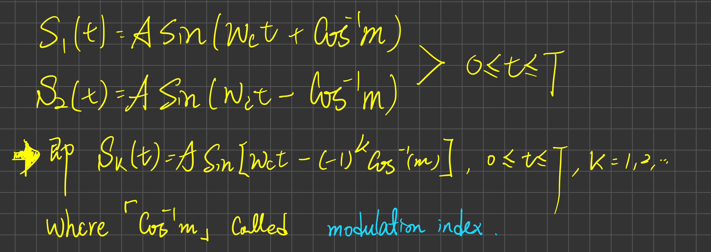


#### 2.1.2 PSK的Matched filter
什麼是Matched Filter：

匹配濾波器（Matched Filter）是一種用於信號處理的濾波器，其設計目的是在存在雜訊的情況下，最大化信號的信噪比（SNR）。匹配濾波器通常用於檢測已知信號的存在，特別是在通信系統中接收和解調信號時非常有用。


要知道PSK的Matched filter，首先我們要先定義數位通信系統如何辨識訊號。以下是一個完整的通訊系統方塊圖：

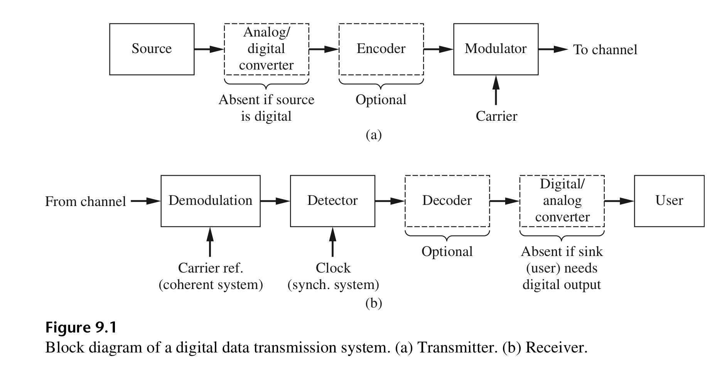
source：Principles of communications systems, modulation, and noise. Roder E. Ziemer, William H. Tranter

而matched filter就落在Demodulation的部分，


下方圖片是推導Matched filter的方程式，我們定義訊號經過一黑盒子，就能達到最佳的SNR及最低的錯誤率，而這個黑盒子我們就叫做
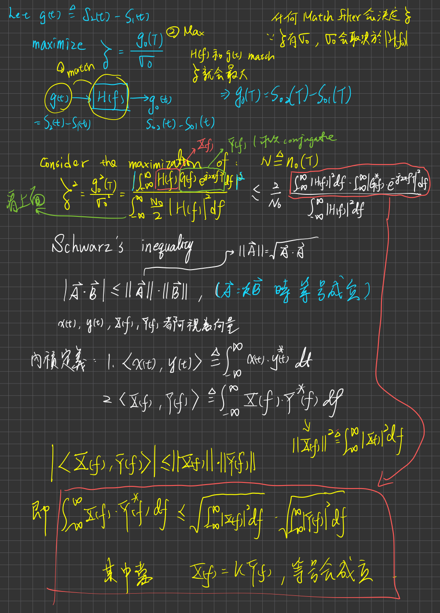matched filter

但是上面證明的是$z$的最大值，為了能讓Q-function最小，這樣錯誤率就會最小(之後會談到)。

並且我們希望是柯西不等式是發生在等號成立的時候，因為這樣$z$就是最大值，所以現在是要製造不等式成立的情況。

我們學過線性代數就知道，柯西不等式要成立的條件是向量$u$ 和$v$ 線性相關，即存在一個常數$λ$，使得$u=λv=u=λv$
而以下是我對於z的最大值推導，因為推導式子有當初令的$H(f)$

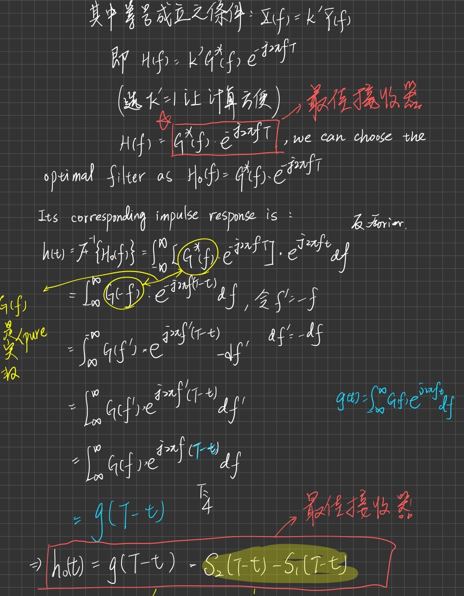

最終我們可知道，一通訊系統的最佳接收器為$h_0(t)=f(T-t)=S_2(T-t)-S_1(T-t)$，而這裡的$S_1$和$S_2$分別是載波。

有了上述的基礎，我們就可以推導PSK版本的matched filter，
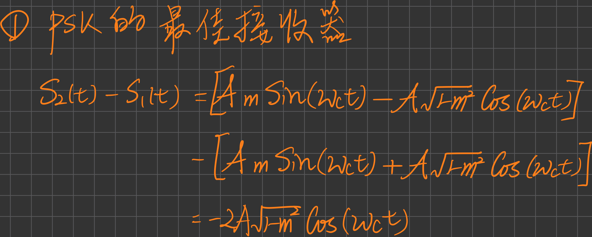


#### 2.1.3 PSK的最佳Threshold
我們有兩種方法來計算最佳Threshold，分別是：
1. 利用兩Random process信號的Gaussian分佈來找
2. 利用摺積和能量的方式來理解


#### Random process信號的Gaussian
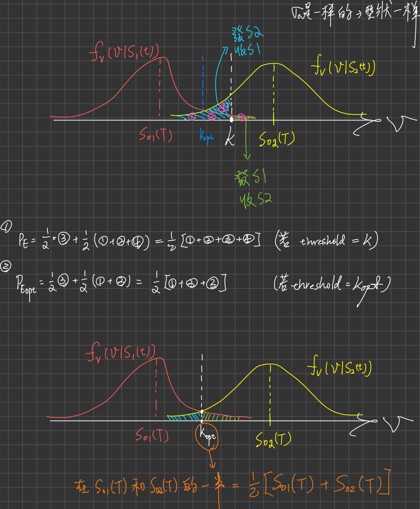
其實我們不難發現就是兩者Gaussian分佈的交點

#### 利用摺積和能量的方式來理解
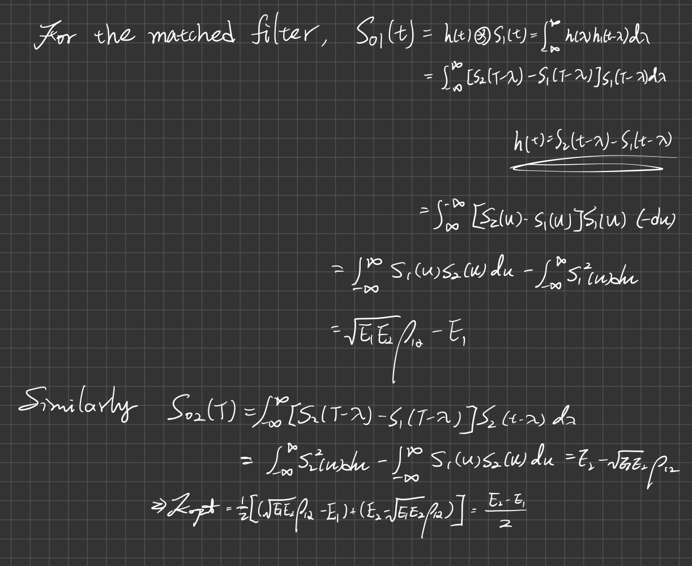
其實我們可以用直覺的方式來理解。在分辨訊號是S1 or S2，最簡單就是看誰的能量多，就屬於誰接收。以這個邏輯來說，對於這個公式的理解就會很容易。

知道以上事實，我們就可以利用"摺積和能量的方式來"計算PSK的最佳Threshold，如下圖：

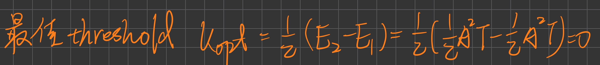

其實也不難理解，我載波變動的東西是相位，對於能量觀點，弦波變化(隨著載波)，對於能量的變化還是一樣，因為都是0.5

#### 2.1.4. PSK的錯誤率
首先我們要了解 PSK的錯誤率，就要先做Matched filter下的錯誤率，如下圖：
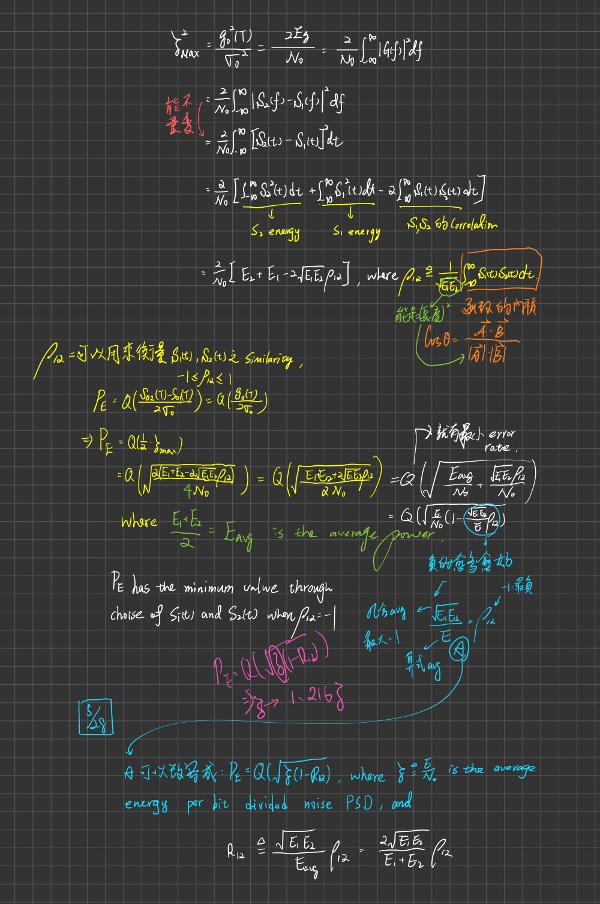
為什麼會有相關係數在裡面?這個也滿好理解的，因為當兩個信號不像(不相關，相關係數=-1)，代表機器可以輕易的分辨出來兩者的差異，這表示說，當機器可以快速分辨，錯誤率就很低；兩個信號很像(相關，相關係數=1)，代表機器很難分辨出來兩者的差異，錯誤率自然就會提高。


### 2.2.1 BPSK (Binary Phase Shift Keying)
BPSK 是最簡單的PSK形式，通過兩個相位狀態（通常是0度和180度）來表示二進位資料的0和1。BPSK 的調製過程如下：

- 對於二進位“0”，載波信號保持初始相位。
- 對於二進位“1”，載波信號的相位會翻轉180度。

BPSK 的優點是其實現簡單且抗雜訊能力強，但其頻譜效率較低，即每個符號只能攜帶1bit資訊。


### 2.2.2 QPSK (Quadrature Phase Shift Keying)
QPSK 是另一種常見的PSK形式，通過四個相位狀態（0度、90度、180度和270度）來表示兩個二進位位元。因此，每個符號攜帶2 bits資訊，提高了頻譜效率。QPSK 的調製過程如下：

- “00” 對應於0度相位。
- “01” 對應於90度相位。
- “10” 對應於180度相位。
- “11” 對應於270度相位。


QPSK 的優點是頻譜效率較高，但相對於BPSK，其抗雜訊能力稍差。

### 2.2.3 PSK的優缺點

**優點：**
- PSK 調製技術簡單，實現成本低。
- BPSK 具有較強的抗雜訊能力，適用於低信噪比環境。
- QPSK 頻譜利用率高，適用於高速資料傳輸。

**缺點：**
- 隨著調製階數的增加（例如8PSK，16PSK），系統的抗雜訊能力會下降。
- PSK 在多徑傳播環境中可能會出現較嚴重的碼間干擾（ISI）。<br>

### 2.3 數位信號處理基礎 (Fundamentals of Digital Signal Processing)

PSK 調製和解調過程中涉及以下基本的數位信號處理技術：

- **濾波 (Filtering)：** 濾波器用於去除信號中的雜訊和干擾，提高信號品質。
- **混頻 (Mixing)：** 混頻器用於將基帶信號與載波信號進行混合，生成調製信號。
- **相位檢測 (Phase Detection)：** 在解調過程中，相位檢測器用於從接收到的信號中提取相位資訊，從而還原出原始資料。
- **同步 (Synchronization)：** 信號的時域和頻域同步是成功解調的關鍵。時域同步確保符號的準確定位，頻域同步則確保載波的頻率和相位一致。

PSK 是一種重要的數位調製技術，在現代通信系統中得到了廣泛應用。通過利用 FPGA 實現 PSK 調製和解調，可以進一步提高通信系統的性能和靈活性。


## 3. FPGA基礎 (Basics of FPGA)
### 3.1 FPGA簡介 (Introduction to FPGA)
FPGA是一種集成了大量可程式設計邏輯單元的晶片，具有高並行處理能力，非常適合即時信號處理任務。而本專題我們用的Basy3這塊板子。

### 3.2 FPGA的優點 (Advantages of FPGA)
- 高度可程式設計性
- 靈活性
- 高速即時處理


## 4. 系統設計 (System Design)
### 4.1 總體設計 (Overall Design)
本設計包括：
- 調製模組
- 解調模組
- 載波生成模組
- 控制模組(除頻器、M序列產生器、testbench)


各模組通過匯流排互連，形成完整的PSK系統。

### 4.2 模組劃分 (Module Division)
1. 調製模組負責將輸入的數位資料轉換為PSK信號
2. 解調模組則將接收到的PSK信號還原為數位資料
3. 載波生成模組生成所需的正弦波載波
4. 控制模組協調各部分的工作


## 5. Verilog實現 (Verilog Implementation)
### 5.1 調變模組 (Modulation Module)
```verilog
// PSK Modulation
always @(posedge clk_1M or negedge rst) begin
  if (!rst) begin
    Mod_out0 <= 0;
    Mod_out1 <= 0;
  end else begin
    if (M_out == 1'b0)
      Mod_out0 <= cos0;
    else
      Mod_out1 <= sin1;
  end
end
```

### 5.2 解調模組 (Demodulation Module)
```verilog
// PSK Demodulation
always @(posedge clk_1M or negedge rst) begin
  if (!rst)
    demod_out <= 0;
  else if (received_signal == cos0)
    demod_out <= 1'b0;
  else if (received_signal == sin1)
    demod_out <= 1'b1;
end
```
### 5.3 載波生成 (Carrier Generate)
在 Vivado 中生成正弦波和餘弦波通常是通過使用數字信號處理技術來實現的。以下是一些常見的方法和原理：

1. 查找表法 (Look-Up Table, LUT)
查找表法是生成正弦波和餘弦波最常見的方法之一。其基本思想是預先計算和存儲一個週期內的正弦波和餘弦波值，然後根據需要進行查詢和輸出。

2. 數字直接合成 (Direct Digital Synthesis, DDS)
DDS 是一種數字信號處理技術，通過數字方式生成各種波形，包括正弦波和餘弦波。DDS 系統包括一個相位累加器和一個查找表。

### 5.3.1 查找表法 (Look-Up Table, LUT)
**步驟：**
1. 生成查找表：
- 使用 **MATLAB** 或其他工具生成正弦波和餘弦波的一個週期內的數據點。
- 將這些數據點存儲在 Verilog 設計中的記憶體或陣列中。


2. 查找和輸出：
- 設計一個計數器，用於指示查找表中的位置。
- 根據計數器的值查詢對應的正弦波或餘弦波數據，並輸出。  


**例子(不是本專題內的程式碼)：**

```verilog
module sine_wave_gen(
    input wire clk,
    input wire rst,
    output reg [11:0] sin_out,
    output reg [11:0] cos_out
);

reg [7:0] addr;
reg [11:0] sine_lut[0:255];
reg [11:0] cosine_lut[0:255];

// Initialize the lookup table
initial begin
    $readmemh("sine_lut.hex", sine_lut);
    $readmemh("cosine_lut.hex", cosine_lut);
end

always @(posedge clk or posedge rst) begin
    if (rst) begin
        addr <= 8'd0;
    end else begin
        addr <= addr + 8'd1;
    end
end

always @(posedge clk) begin
    sin_out <= sine_lut[addr];
    cos_out <= cosine_lut[addr];
end

endmodule

```

### (補充)使用 MATLAB 生成查找表
使用 MATLAB 可以方便地生成正弦波和餘弦波的查找表數據，並導出為 Verilog 可以讀取的格式。

```matlab
N = 256;
sine_lut = sin(2*pi*(0:N-1)/N) * 2047 + 2048;
cosine_lut = cos(2*pi*(0:N-1)/N) * 2047 + 2048;

fileID = fopen('sine_lut.hex','w');
fprintf(fileID, '%03X\n', round(sine_lut));
fclose(fileID);

fileID = fopen('cosine_lut.hex','w');
fprintf(fileID, '%03X\n', round(cosine_lut));
fclose(fileID);
```

然而，上述程式碼對於波形繪畫並不細膩，因為只取了零點與上下峰值點。如下圖所示：
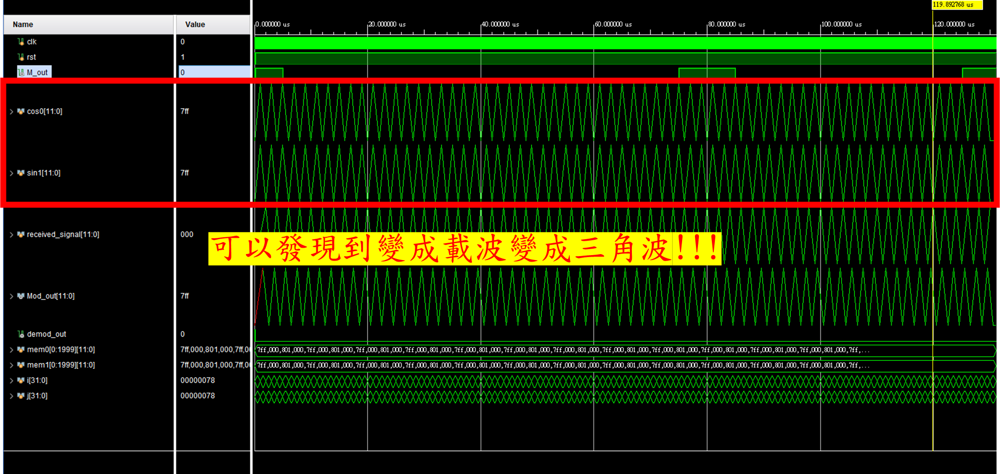

所以將要對上述程式碼進行修改，以下是我們對細膩度的程式碼修改：

1. sin wave：

```matlab
% Set parameters
f1 = 5000; % waveform frequency
fs = 32 * f1; % sampling frequency, ensuring 32 points per cycle
N = 12; % number of quantization bits
num_cycles = 2000; % number of cycles
samples_per_cycle = 32; % sampling points per cycle

% Generate time vector
t = 0:1/fs:(samples_per_cycle * num_cycles - 1)/fs;

% Generate sine wave
sin_wave = 2047 * sin(2 * pi * f1 * t);

% Quantize to 12 bits
quantized_wave = round(sin_wave);

% Convert positive and negative values to 12-bit signed values
quantized_wave(quantized_wave >= 2048) = 2047; % Set values greater than or equal to 2048 to the maximum value
quantized_wave(quantized_wave <= -2048) = -2048; % Set values less than or equal to -2048 to the minimum value

% Convert to 12-bit binary strings
binary_wave = dec2bin(quantized_wave + 2048, N);

% Write to text file
fid = fopen('C:\homework\Communication experiment\project\testdata_sin', 'w');
for i = 1:length(binary_wave)
    fprintf(fid, '%s\n', binary_wave(i, :));
end
fclose(fid);

```

2. cos wave：
```matlab
% Set parameters
f1 = 5000; % waveform frequency
fs = 32 * f1; % sampling frequency, ensuring 32 points per cycle
N = 12; % number of quantization bits
num_cycles = 2000; % number of cycles
samples_per_cycle = 32; % sampling points per cycle

% Generate time vector
t = 0:1/fs:(samples_per_cycle * num_cycles - 1)/fs;

% Generate cos wave
cos_wave = 2047 * cos(2 * pi * f1 * t);

% Quantize to 12 bits
quantized_wave = round(cos_wave);

% Convert positive and negative values to 12-bit signed values
quantized_wave(quantized_wave >= 2048) = 2047; % Set values greater than or equal to 2048 to the maximum value
quantized_wave(quantized_wave <= -2048) = -2048; % Set values less than or equal to -2048 to the minimum value

% Convert to 12-bit binary strings
binary_wave = dec2bin(quantized_wave + 2048, N);

% Write to text file
fid = fopen('C:\homework\Communication experiment\project\testdata_cos', 'w');
for i = 1:length(binary_wave)
    fprintf(fid, '%s\n', binary_wave(i, :));
end
fclose(fid);
```

這兩段 MATLAB 程式碼的主要目的是生成一個正弦波形，將其量化成12位的二進制字串，並將這些字串寫入txt檔，以下是程式碼的詳細解釋：

設定波形頻率為5000 Hz，並將採樣頻率設置為波形頻率的32倍，確保在每個週期內有32個採樣點，接著設定量化位數為12位，並指定需要生成的正弦波週期數為2000個 (週期可根據需求改變)。每個週期有32個採樣點，因此總共會有64000個採樣點。

接下來，生成時間向量。時間向量從0開始，以每次1/160000秒的步長增長，一直到64000個時間點。這樣可以確保在每個週期內有32個均勻分布的時間點。

使用時間向量和設定的波形頻率，可以生成一個振幅為2047的餘弦波，波形的中心值為0，峰值為2047，由於弦波的特性，這個波形會在每個週期內在-2047和2047之間變化。

生成餘弦波後，需要將其量化為12位整數，”第一位為Signed bit”，取整後的波形值會在-2047到2047之間。

為了確保量化後的值在12位有符號整數的範圍內，因此對量化後的值進行限制，所有大於等於2048的值都設置為2047，所有小於等於-2048的值都設置為-2048，這樣可以將所有的量化值都在-2048到2047之間，符合12位有符號整數的範圍。

接著，將量化後的波形值轉換為12位的二進制字串。由於MATLAB的 `dec2bin` 函數不支持直接處理負數，因此先將量化後的值加上2048，使其變為非負數，然後轉換為二進制字串。

1.	處理負值： 在進行二進位轉換之前，我們需要處理負值，直接將負數轉換成二進位會導致錯誤結果，因此需要一個偏移量來確保所有數值都是正數，這裡我們選擇了 2048 作為偏移量，因為這樣可以確保所有數值都在 0 到 4095 之間，即：
o	-2048 變成 0
o	0 變成 2048
o	2047 變成 4095

2.	轉換為二進位： dec2bin 函數將十進位數值轉換為二進位字串，第二個參數 N 指定了字串的長度，這裡為 12 位，確保了所有轉換後的二進位字串長度一致，不足 12 位的用零補齊。

具體範例:
假設我們有以下量化值：
•	quantized_wave = [-2048, -1024, 0, 1024, 2047]
進行轉換的步驟如下：
1.	加上偏移量 2048：
-	-2048 + 2048 = 0
-	-1024 + 2048 = 1024
-	0 + 2048 = 2048
-	1024 + 2048 = 3072
-	2047 + 2048 = 4095
2.	轉換為12位的二進位字串：
-	0 變成 000000000000
-	1024 變成 000100000000
-	2048 變成 100000000000
-	3072 變成 110000000000
-	4095 變成 111111111111
最後，將這些二進制字串寫入txt檔，給予輸出路徑，使用 `fprintf` 函數將每一個二進制字串寫入文件。

總結這部份的流程：
1.	設置參數，生成時間向量。
2.	生成指定頻率和週期數的正弦波。
3.	將正弦波量化為12位整數。
4.	將量化後的整數限制在12位有符號整數範圍內。
5.	將這些整數轉換為12位的二進制字串，輸出檔案。

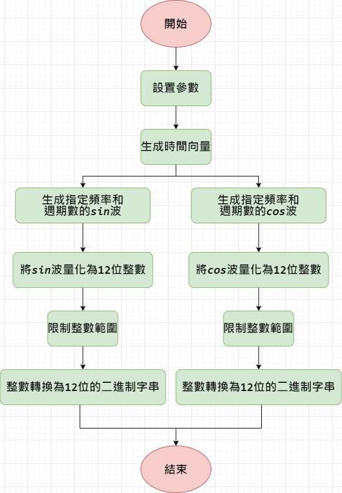

### 5.3.2 數字直接合成 (Direct Digital Synthesis, DDS)
**步驟：**
1. 相位累加器：
- 設計一個相位累加器，用於生成相位增量。每個時鐘週期增加固定的相位增量。
- 相位累加器的輸出作為查找表的地址。

2. 查找和輸出：
- 用相位累加器的輸出查詢查找表，獲取對應的正弦波或餘弦波值。


**例子(不是本專題內的程式碼)：**
```verilog
module dds_wave_gen(
    input wire clk,
    input wire rst,
    input wire [31:0] phase_inc, // Phase increment
    output reg [11:0] sin_out,
    output reg [11:0] cos_out
);

reg [31:0] phase_acc;
reg [7:0] addr;
reg [11:0] sine_lut[0:255];
reg [11:0] cosine_lut[0:255];

// Initialize the lookup table
initial begin
    $readmemh("sine_lut.hex", sine_lut);
    $readmemh("cosine_lut.hex", cosine_lut);
end

always @(posedge clk or posedge rst) begin
    if (rst) begin
        phase_acc <= 32'd0;
    end else begin
        phase_acc <= phase_acc + phase_inc;
    end
end

assign addr = phase_acc[31:24];

always @(posedge clk) begin
    sin_out <= sine_lut[addr];
    cos_out <= cosine_lut[addr];
end

endmodule
```


### 5.4輸出結果
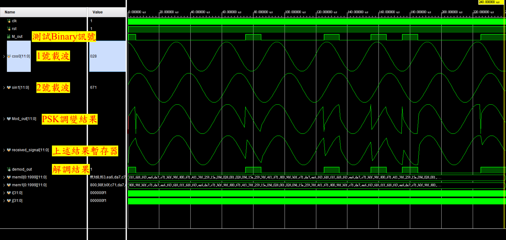
我們該如何解讀這張圖，首先先看到**測試Binary訊號**。這個是一個隨意生成的輸入Binary訊號。<br>

這個輸入Binary訊號是利用M-ary產生器，所產生的信號。

#### 
以下 Verilog 代碼展示了兩個模塊的實例化：一個是 clk_div，另一個是 M_gen。這兩個模塊協同工作來生成一個多相序列（M序列）。

1. clk_div 模塊
代碼分析：
```verilog
clk_div #(
  .Max (500)  // 設定參數 Max 的值為 500
) u3 (
  .clk(clk),  // 輸入時鐘信號
  .rst(rst),  // 輸入重置信號
  .clk_div(clk_M)  // 輸出分頻後的時鐘信號
);
```
#### 解釋：

- 參數設置：

1. Max (500)：這個參數設定了分頻器的最大計數值。在這個例子中，分頻器將計數到 500。


- 端口連接：

1. clk：輸入的時鐘信號。
2. rst：輸入的重置信號，用於初始化或重置模塊。
3. clk_div：輸出的分頻時鐘信號。在這裡，該信號被命名為 clk_M，表示這是經過分頻後的時鐘信號。


clk_div 模塊通過計數來實現時鐘分頻，當計數達到設定的最大值 Max 時，輸出時鐘信號 clk_div 翻轉一次。這樣，輸出時鐘的頻率會是輸入時鐘的頻率除以 (Max+1)。


2. M_gen 模塊
代碼分析：
```verilog
M_gen #(
  .width (8)  // 設定參數 width 的值為 8
) u4 (
  .clk(clk_M),  // 輸入分頻後的時鐘信號
  .rst(rst),    // 輸入重置信號
  .M_out(M_out)  // 輸出 M 序列信號
);
```

#### 解釋：
- 參數設置：

1. width (8)：這個參數設定了 M 序列生成器的寬度。在這個例子中，M 序列的寬度為 8 位。


- 端口連接：

1. clk：輸入的分頻後的時鐘信號，這裡是 clk_M。
2. rst：輸入的重置信號，用於初始化或重置模塊。
3. M_out：輸出的 M 序列信號。


M_gen 模塊是一個多相序列生成器，通常用於生成偽隨機序列。這些序列在數字通信、加密和測試中廣泛應用。M 序列（Maximum Length Sequence）是由線性反饋移位寄存器 (LFSR) 生成的，具有最大周期性且擁有良好的統計特性。


再來，我們會需要將載波利用DAC的方式做轉換，在一開始沒有做DAC轉換的模擬結果會長得像以下圖片：
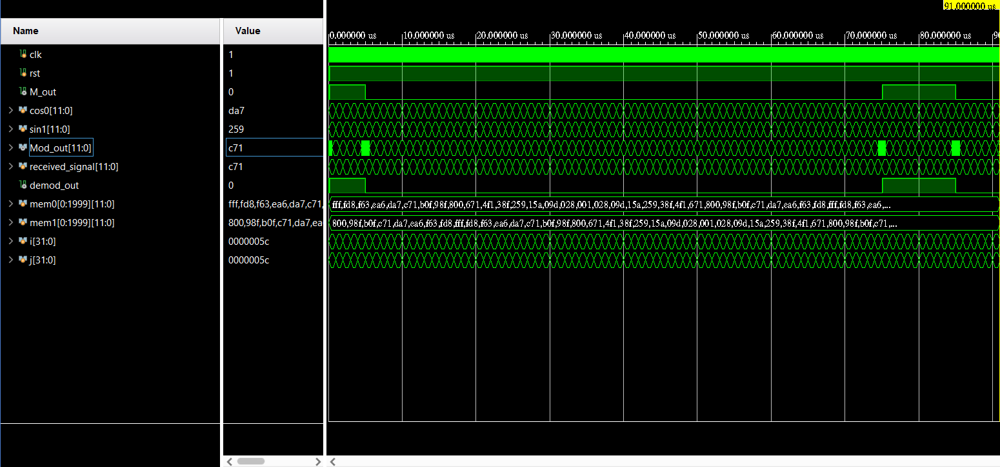


在數位電路設計軟體如 Vivado 中，輸出模擬圖通常是數位方波圖。儘管如此，在數位通信中，一些調變方式（如相位偏移鍵控，PSK）依賴於類比弦波信號作為載波。因此，能夠在模擬軟體中顯示類比信號是非常重要的。以下介紹如何在 Vivado 中達成類比弦波的顯示。

模擬環境設置
1. 設計數位電路生成數位信號：

首先，在 Vivado 中設計數位電路，該電路能生成代表弦波的數位信號。這通常是通過數位波形來近似模擬類比弦波。例如，可以設計一個數位振盪器，產生一系列代表弦波的離散數位值。

2. 數位類比轉換 (DAC)：
將數位信號轉換為類比信號的關鍵步驟是使用數位類比轉換器 (DAC)。DAC 接收數位輸入，並將其轉換為對應的連續類比電壓或電流信號。
<center> $LO(t)=cos⁡(2πf_{\text{LO}}t)+jsin⁡(2πf_{\text{LO}}t)$ </center>

公式中，$f_{\text{LO}}$是本地振盪器的頻率，$𝑡$是時間變數。這裡使用的是複數表示法，其中 
$j$代表虛數單位。

3. 濾波：

為了平滑數位信號並消除高頻成分，通常會在 DAC 的輸出端使用低通濾波器。例如，一階 RC 低通濾波器可以有效地平滑輸出信號，使其更接近理想的弦波。

【詳細步驟】
1. 設計數位信號生成電路：
- 在 Vivado 中設計一個簡單的數位信號生成電路，例如使用查找表 (Look-Up Table, LUT) 來存儲弦波的離散取樣值。這些值可以根據需要的頻率和解析度預先計算好，然後在電路中循環輸出。

2. 數位類比轉換 (DAC)：
- 選擇適當的 DAC，配置其參數以適應數位信號的輸出範圍和頻率。DAC 將數位輸入轉換為相應的類比電壓或電流信號。

3. 設計低通濾波器：
- 設計一個適當的低通濾波器來平滑 DAC 的輸出信號。選擇合適的電阻和電容值，確定截止頻率，使其能有效濾除高頻噪聲，同時保留信號的主要頻帶。

4. 模擬和觀察：
- 在 Vivado 中運行模擬，觀察數位信號生成、DAC 輸出和濾波器輸出的波形。可以使用 Vivado 的波形查看工具來檢查各階段的信號。最終應該能看到平滑的類比弦波信號。
總結

在Vivado中，上述複雜步驟可以利用wave style來達成，只要我們對該訊號點擊右鍵，如下圖：
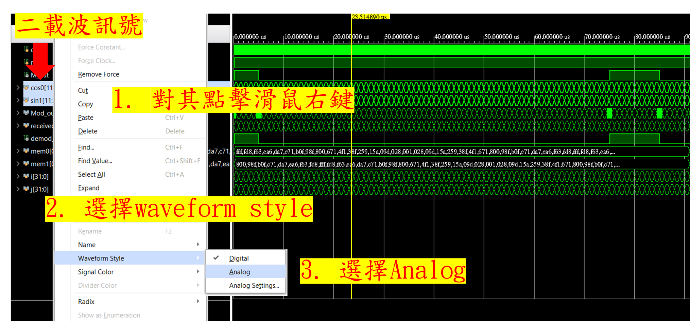

就能將數位訊號轉換成類比訊號。


網頁展示
--
網站網址:https://snow200110.github.io/PSK.github.io/PSK.html

- 網頁字體設計:
    從google fonts中引入英文與中文字型，同時設定網頁一開始的背景顏色與字體顏色，CSS程式碼如下:
 ```css
@import url('https://fonts.googleapis.com/css2?family=Caveat:wght@400..700&display=swap');
@import url('https://fonts.googleapis.com/css2?family=Noto+Sans+TC:wght@100..900&display=swap');

* {
    background-color: #F1E5D1;
}

body {
    font-family: Caveat, "Not+Sans+TC", sans-serif;
    letter-spacing: 1px;
    margin: 0;
    color: white;
    line-height: 1.4;
}
```

- Home page

#### **功能介紹:**

主要可分成四個區塊，分別為header、 view project、about us與footer

- Header:  
  呈現題目主題與分頁按鈕，負責連結各個分頁，點擊文字即可以更換分頁，當滑鼠經過或停留在文字上文字顏色轉換成灰色，html程式碼如下:
```html
<header>
    <div class="wrapper-content">
        <h1 class="topic">Xilinx Vivado 實現數位 PSK 調變系統設計</h1>
        <nav class="header-nav">
            <a class="pagination" href="PSK.html" >HOME</a>
            <a class="pagination" href="Introduction.html">INTRODUCTION</a>
            <a class="pagination" href="process.html" >PROCESS</a>
            <a class="pagination" href="Result.html" >RESULT</a>
        </nav>
    </div>
    <br/>
    <br/>
</header>
```
 當滑鼠經過或停留在文字上文字顏色轉換成灰色，CSS程式碼如下:
```CSS
/*碰到分頁按鈕顏色轉成灰色*/
.pagination:hover{
    transition: all 0.3s;
    color: gray;
}
```

- View project:  
  主要視覺中心，有增加圖片與文字動畫，讓畫面更加生動，動畫是由下往上浮，html程式碼如下:  
```html
<section class="section-primary">
    
    <div class="wrapper-primary-text">
        <p class="primary-text">Welcome To Our Project Web</p>
        <p class="primary-text">Press the button to view our project</p>
        <a class="link-button" href="Result.html">View Project</a>
    </div>
</section>
```
   當滑鼠經過或停留在按鈕上，將轉換成灰色，CSS程式碼如下:
```CSS
/*碰到按鈕顏色轉成灰色*/
.link-button{
    text-align: center;
    background-color: #03506F;
    color:white;
    font-size: 50%;
    padding: 1% 10% 1% 10%;
    border-radius: 20px;
    border-color: none;
}
.link-button:hover{
    background-color: gray;
    border-color: none;
}
```

- About us:  
  組員Q版圖片與組員名字，於頂部的"About Us"文字同時也有從下往上浮的動畫  
```html
<section>
    <p class="about-content">About Us</p>
    <div class="wrapper-image-about">
        
        
        
        
    </div>
    <div class="teammember-about">
        <p class="member-detail">李晉丞</p>
        <p class="member-detail">林士軒</p>
        <p class="member-detail">張星瑀</p>
        <p class="member-detail">盧翊禎</p>
    </div>
</section>
```

    
- Footer:  
  方便使用者需滑到最上面去切換分頁，下方增加Navigation，點擊文字即可以更換分頁，當滑鼠經過或停留在文字上文字顏色轉換成灰色
```html
<footer>
    <div class="wrapper-content-footer">
        <div class="footer-list">NAVIGATION
            <a href="PSK.html" class="navigation-text-link">HOME</a>
            <a href="Introduction.html" class="navigation-text-link">INTRODUCTION</a>
            <a href="process.html" class="navigation-text-link">PROCESS</a>
            <a href="Result.html" class="navigation-text-link">RESULT</a>
        </div>
    </div> 
</footer>
```

- 網頁動畫:      
    動畫部分是利用ScrollReveal此網站所提供的程式碼，在HTML中JavaScript的寫法如下:
```html
<script>
    ScrollReveal({
        reset: true,
        distance: '60px',
        duration: 2500,
        delay: 300
    });
    ScrollReveal().reveal('.primary_main-img', { delay: 400, origin: 'bottom' });
    ScrollReveal().reveal('.wrapper-primary-text', { delay: 450, origin: 'right' });
    ScrollReveal().reveal('.about-content', { delay: 400, origin: 'bottom' });
</script>
```

<div style="text-align:center">
 

  主畫面

  主畫面-組員介紹
</div>
  
  <li style=" list-style-type: circle">Introduction</li>
  <h4> <strong>功能介紹:</strong></h4> 
  <p>此頁主要是介紹使用之器材與PSK之介紹，於頂部的"Introduction"文字同時也有從下往上浮的動畫</p>  
  <div style="text-align:center">


  Introduction
</div>


  <li style=" list-style-type: circle">Process</li>
  <h4> <strong>功能介紹:</strong></h4> 
  <p>此頁主要是介紹實驗步驟與程式碼解析，於頂部的"Process"文字同時也有從下往上浮的動畫</p> 
  <div style="text-align:center">
   
  Process 首頁
  </div>  

  <li style="list-style-type: circle">Result</li> 
  <h4> <strong>功能介紹:</strong></h4> 
  <p>此頁負責展示實驗最後之結果，於頂部的"Result Demo"文字同時也有從下往上浮的動畫</p>  
  <div style="text-align:center">
    
  Result Demo
</div>

</ul>  